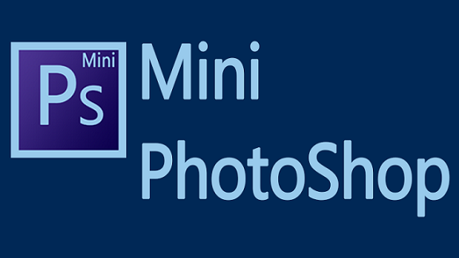

# MiniPhotoShop 项目报告 Part3

### 编写者

姓名：郭慧钊 

学号：3150104667

邮箱：3150104667@zju.edu.cn

***

​	本人主要负责的模块是View，参与了部分ViewModel的设计。

​	View模块主要的功能是显示以及与用户的交互，接受用户的操作数据并且向ViewModel发送命令。本人在ViewModel中主要编写了` RefreshDisplayImage(int) `函数，该函数用于绘制各个图层并且将图层按顺序合并最终输出可用于显示的图片。

​	接下来介绍分为两个部分：View模块与ViewModel的` RefreshDisplayImage(int) `函数。

## View模块报告

​	View模块主要使用Qt5实现，采用状态机的方式进行状态管理与转换。

​	View包括4个窗体类(*MainWindow* , *ImageWidget* , *ConvolutionDialog* , *NewCanvasDialog*)、1个状态基类(*BaseState*)、13个状态类、1个状态通用操作类(*StateCommonAction*)与1个状态管理类(*StateManager*)。

### UI整体功能

1. SplashScreen

   打开程序后，会首先显示2秒欢迎界面

   

2. Wizard 

   欢迎界面之后，会显示向导窗口与主窗口

   

3. MainWindow
  主窗口中心为主绘图区域，最上方为菜单栏，菜单栏下方为快捷工具栏。
  快捷工具栏下方为描边与填充设置区，从左至右依次为：描边颜色设置、描边宽度设置、描边线型设置、填充颜色设置、填充方式设置。
  窗口下方为状态栏，显示缩放与操作提示。
  窗口右侧为图层列表。
  

4. Buttons & Pop Menus

   将鼠标移至画布并滚动鼠标滚轮可以缩放画布，在画布以及图层列表上单击鼠标右键可以显示弹出式菜单。

   单击快捷工具栏或菜单栏可以切换工具或执行操作，图层列表上方三个按键的功能分别为上移当前图层、下移当前图层与删除当前图层。
   画布上的弹出式菜单
   
   图层列表中的弹出式菜单
   
   可浮动的快捷工具栏
   
   画布的缩放功能
   
   
   
5. Other Windows
  前景色与背景色设置窗口
   
  新建工程窗口
  
   卷积核设置窗口
  

### MainWindow类

​	*MainWindow*类是程序的主窗口，也是View模块与其他部分对接的类。有一些设置命令的函数，并且通过指针绑定了ViewModel层的displayImage用于显示。另外还有一些槽函数用于与其他控件通信。通过通知的方式接受ViewModel的消息以同步数据。在按键被按下时调用*StateManager*来处理事件并改变状态。通过ViewModel层绑定了Model中的*pen*和*brush*变量，并且将变量传递给了*MainDisplayWidget*控件。

### ImageWidget类

​	*ImageWidget*类是主窗口中用于显示的显示区域，负责将ViewModel计算好的displayImage显示在窗口上，并且接受用户的鼠标操作事件，调用*StateManager*来处理事件并改变状态。

### ConvolutionDialog类

​	*ConvolutionDialog*类是用于设置卷积核的窗口，该类有一个静态成员函数`static Params GetConvolutionCore(QWidget*,int)`，用于设置卷积核。调用该函数后，会弹出一个阻塞窗口，当该窗口被关闭时函数返回，并且用*Params*类返回结果。

### NewCanvasDialog类

​	*NewCanvasDialog*类是用于设置画布尺寸的窗口，该类有一个静态成员`static Params GetCanvasSize(QWidget *);`。调用该函数后，会弹出一个阻塞式窗口，当该窗口被关闭时函数返回，并且用*Params*类返回结果。

## ViewModel 部分函数报告

` RefreshDisplayImage(int) `函数接受一个参数，表示需要重绘的图层序号，如果该参数小于0，则不重绘。最终更新ViewModel中的displayBuffer与displayImage。
重绘部分调用Qt的二维绘图工具类QPainter，根据BaseShape的type对不同的图元采用不同的绘制方式。最终按顺序将所有displayBuffer的元素merge为一个displayImage，供View层显示。

​	

