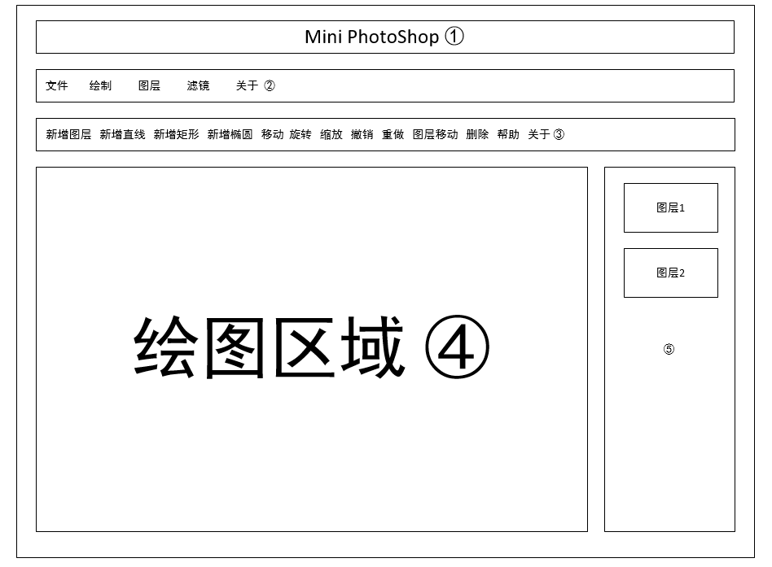
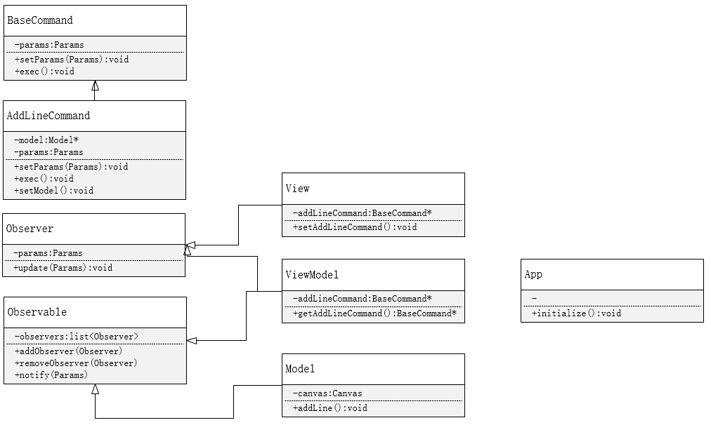

# MiniPhotoShop 需求文档

## 整体需求
设计一款便于使用的图像编辑和处理软件，要求具备图层管理、简单几何操作、导入导出、图像处理滤镜等功能，满足日常图片处理的需求。
## 界面设计
### 原型图

## 使用语言及框架
为了使得该软件能够兼容各种平台（OS X，Linux，Windows），应采用跨平台框架或语言编写，推荐使用C++和Qt5。

### 界面说明
软件界面应由标题栏①，菜单栏②，工具栏③，绘图区域④和图层区⑤组成，各区域功能如下：
1. 标题栏
  显示MiniPhotoShop字样，可以加上版本号
2. 菜单栏
    - 文件：打开，新建，保存，另存为
    - 绘制：画线，椭圆，矩形等几何图形
    - 图层：平移、旋转等结合变换，移动图层、删除图层等图层操作
    - 滤镜：反色、直方图均衡、亮度适应、卷积变换、拉普拉斯增强、灰阶化、二值化、亮度调整、双边滤波
    - 关于：关于本程序
3. 工具栏
  如原型图所示，直接点击按钮可以使用相应功能。
4. 绘图区域
  绘图工作区域，所有操作在绘图区域执行和展现。
5. 图层区
  展示图层的上下层叠关系。

## 软件架构
### 整体架构
软件整体采用MVVM框架开发，做到Model，ViewModel和View的解耦，便于多人协作开发，提高并行开发的效率。

Model，ViewModel和View之间通过Command和Observer模式进行通讯和数据同步，各模块之间通讯时只会使用Common层暴露的BaseCommand、Observer、Observable等接口，而不会直接调用其他模块的方法，实现高度解耦。最后由最高层App进行绑定。  
### 样例说明
以画直线操作为例

> 

当view感知到用户的画线操作，它会执行一条画线的Command，该Command由ViewModel产生，由APP绑定至View中。在命令中调用Model的相关函数，从而完成对底层数据的修改。

当底层数据修改完毕后，由于ViewModel观察Model，ViewModel首先接收到Model变化的消息，重新渲染内存中的画布区域，然后通知View获取画布并渲染在用户的屏幕上。

由此数据交互完成。

## 软件开发流程
### 多人协作
使用github的仓库管理代码，实行多人协作开发。

git分支应至少分为`master`,`dev`,`release`，其中各分支功能如下：
- dev
    - 开发在此分支进行，上传到dev的代码应尽量减少bug，至少使程序可编译。
- master：
    - 完成一轮迭代并经过测试后，将dev上的代码合并到master上。
    - master分支应部署持续集成的监听器，一旦master分支更新，应触发远程服务器上的持续集成，使得master上的代码被编译并尽快获得编译结果。
- release
    - master上代码经编译成功后，将生成的可执行文件（包括直接编译生成的linux下可执行文件和交叉编译生成的windows下可执行文件）放到release文件夹中，并push到release分支。
    - 用户可以从release分支上获得最新发布的源代码和跨平台可执行文件。

### 测试
- 对GUI进行严格的人工测试
- 对图像处理算法进行严格的单元测试

## 开发者团队
郭慧钊(hzguo)，金志华(jnzhihuoo1)，马哲(Maryeon)，任意(RayeRen)